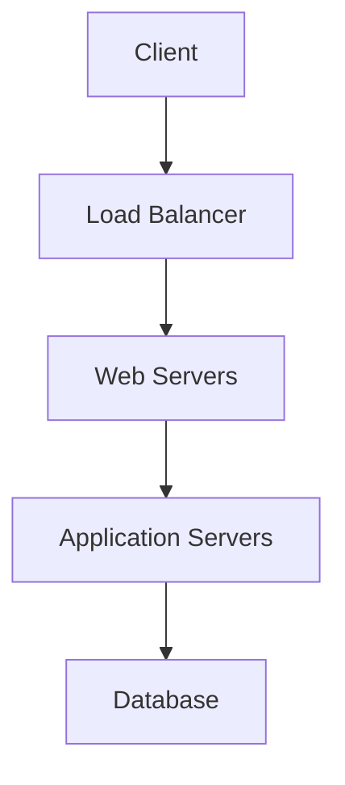

```mermaid
  graph TD
    A[Client] --> B[Load Balancer]
    B --> C[Web Servers]
    C --> D[Application Servers]
    D --> E[Database]
```

# Architecture Overview
This diagram represents the architecture overview showing the connection from a client to the database through various layers.